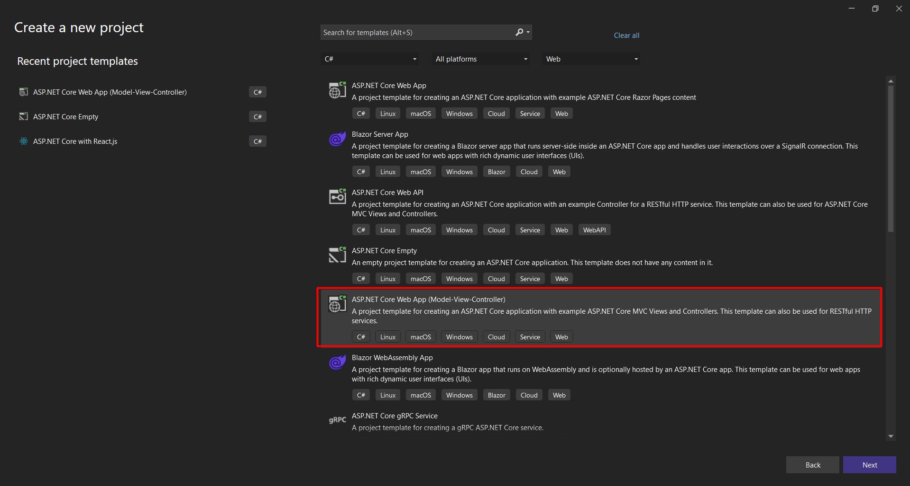
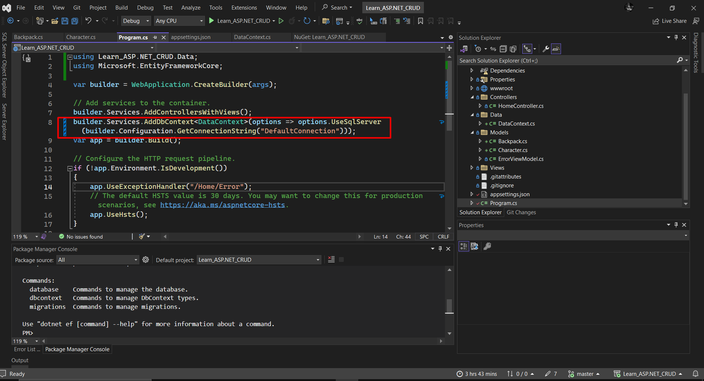

# ASP.NET Core Web App (Model-View-Controller) - VERSIUNEA 7
- Tutorial dupa acest video pana la min 29: https://www.youtube.com/watch?v=V0UF4vEMlhQ
## Creare proiect nou
1. Cand vrei sa creezi un proiect ASP.NET Core Web App (Model-View-Controller) poti selecta varianta asta ca sa ai defaut structura fisierelor dupa arhitectura MVC. Apoi poti alege unde sa il salvezi si ce versiune sa folosesti.

2. Cream un folder nou Data, iar in el cream o clasa noua DataContext.cs, unde adaugam:
```c#
using Microsoft.EntityFrameworkCore;

namespace NUMELE-PROIECTULUI-TAU.Data
{
    public class DataContext : DbContext
    {
        public DataContext(DbContextOptions<DataContext> options) : base(options) { }
    }
}
```
3. In program.cs trebuie sa adaugi linia asta de cod ca sa folosim MySql si DB integrate de la Visual Studio
```c#
builder.Services.AddDbContext<DataContext>(options => options.UseSqlServer(builder.Configuration.GetConnectionString("DefaultConnection")));
```

4. In appsettings.json adauga linia asta, stabilim serverul (in exemplu "localdb") si numele bazei noastre de date (in exemplu apare "learningDb")
```c#
  "ConnectionStrings": {
    "DefaultConnection": "Server=(localdb)\\mssqllocaldb;Database=learningDb;Trusted_Connection=True;MultipleActiveResultSets=true"
  }
```
5. In bara sus dam click pe Project, apoi jos pe Manage NuGet Packager si instalam:
- Microsoft.EntityFrameworkCore
- Microsoft.EntityFrameworkCore.Sqlite
- Microsoft.EntityFrameworkCore.SqlServer
- Microsoft.EntityFrameworkCore.Tools
- Microsoft.VisualStudio.Web.CodeGeneration.Design
- De asemenea sa verificam sa fie versiunile compatibile, adica daca astea 2 sunt versiunea 7 atunci si la proiect trebuie sa avem 7. Ca sa verificam/updatam versiunea proiectului, click sus in bara pe Project, apoi jos "NUMELE-PROIECTULUI-TAU Properties". Apoi la Target Framework putem selecta versiunea dorita.