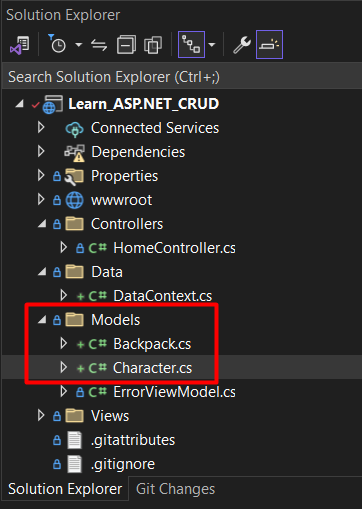
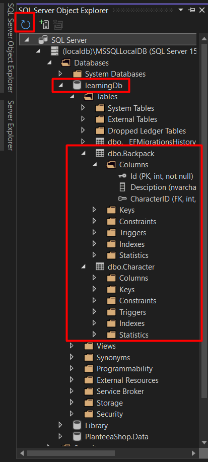
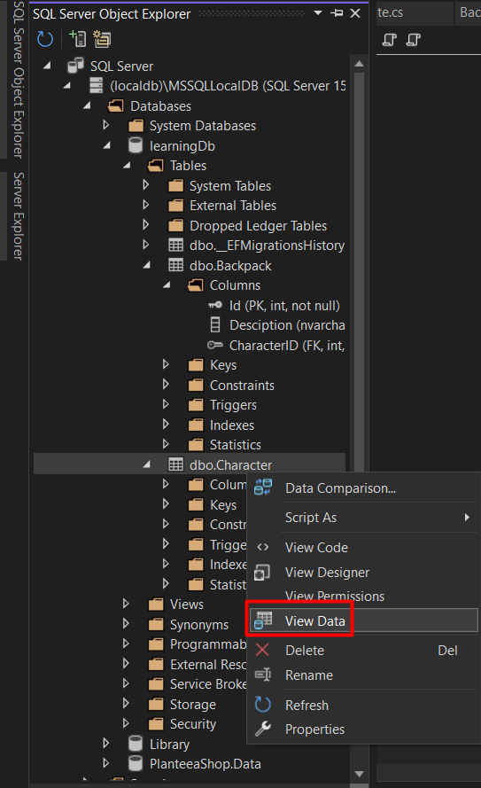
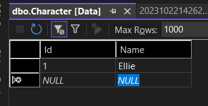
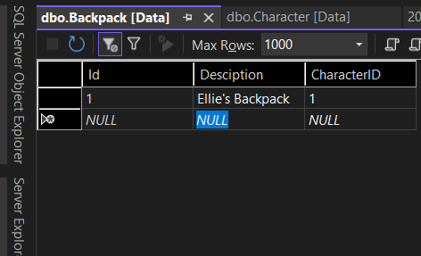
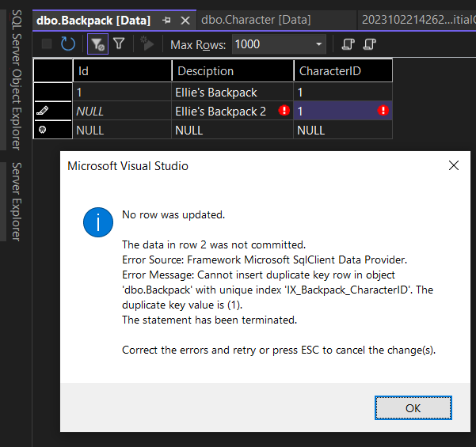

# ASP.NET Core Web App (Model-View-Controller) - VERSIUNEA 7
- Tutorial dupa acest video pana la min 29: https://www.youtube.com/watch?v=V0UF4vEMlhQ
## Relatie One-To-One
6. In folderul Models putem crea 2 modele noi (clase noi). De exemplu Character si Backpack, si putem stabili o relatie one-to-one intre ele.

```c#
// In Backpack putem avea:
public class Backpack
{
    public int Id { get; set; }
    public string Desciption { get; set; }
    public int CharacterID { get; set; } // asta va fi foreign key-ul care conecteaza un caracter la rucsacul său
    public Character Character { get; set; }
}

// In Character putem avea:
public class Character
{
    public int Id { get; set; }
    public string Name { get; set; }
    public Backpack Backpack { get; set; }
}
```
7. Intram inapoi in Data/DataContext.cs si adaugam:
```c#
public class DataContext : DbContext
{
    public DataContext(DbContextOptions<DataContext> options) : base(options) { }

    // Urmatoarele 2 linii trebuie adaugate
    public DbSet<Character> Character { get; set; }
    public DbSet<Backpack> Backpack { get; set; }
}
```
8. Acum va trebui sa intram in consola sa cream migrarile. Pentru a intra in consola, sus in bara dam click pe Tools -> NuGet Package Manager -> Package Manager Console si scriem: add-migration InitialCreate
- Aceasta comanda va crea un folder nou Migrations, unde se vor salva mereu migrarile cand scriem comanda add-migration NumeMigrare
9. Dupa asta, trebuie sa cream baza de date, tot in consola vom scrie: update-database
- Ca sa verificam ca baza de date s-a creat putem da click pe View -> SQL Server Object Explorer
- Se va deschide un window nou mergem pe prima baza, in databases si aici trebuie sa ne apara baza de date cu numele pe care l-ati dat, dupa exemplul scris in acest fisier va fi learningDb. In caz ca nu apare, dati un refresh pe sageata albastra rotunda.

10. Pentru testare rapida, putem da click dreapta pe dbo.Character si VieData si apoi sa cream manual caractere si la fel pentru dbo.Backpack.



11. Daca incercam sa adaugm inca un backpack userului cu id-ul 1 vom primi eroare, ceea ce e corect, deoarece am stabilit relatie one-to-one. Adica 1 caracter poate avea doar 1 backpack.

12. Daca intram inapoi la dbo.Character si stergem caracterul nostru, iar apoi intram inapoi la dbo.Backpack si dam refresh (sageata albastra rotunda) vedem ca si backpack-ul s-a sters, ceea ce din nou e corect.