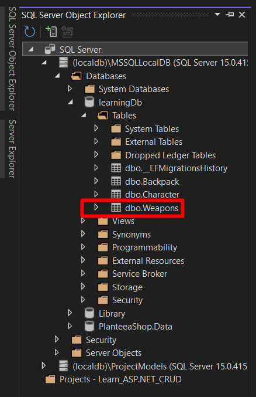
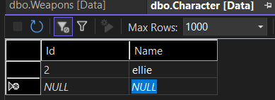
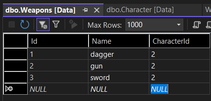
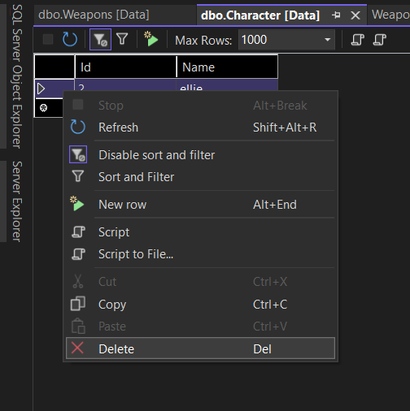

# ASP.NET Core Web App (Model-View-Controller) - VERSIUNEA 7
- Tutorial dupa acest video pana la min 29: https://www.youtube.com/watch?v=V0UF4vEMlhQ
## Relatie One-To-Many
13. Facem un model nou Weapon. Un caracter poate avea mai multe arme, dar o arma nu poate avea mai multe caractere (caractere, adica in sensul de cel care mânuieste armele)
```c#
public class Weapon
{
    public int Id { get; set; }
    public string Name { get; set; }
    public int CharacterId { get; set; } // foreign key pentru character
    public Character Character { get; set; }
}
```
14. Deschidem acum modelul Character si adaugam lista pentru a face relatie de one-to-many:
```c#
public class Character
{
    public int Id { get; set; }
    public string Name { get; set; }
    public Backpack Backpack { get; set; }

    // List weapon e codul nou adaugat pentru a conecta caracterul de arme 
        // Se scrie weapon cu s, adica la plural deoarece caracterul foloseste mai multe arme
        // (observatie: nu e vorba de modelul Weapon, modelele prin conventie se scriu la singular)
    public List<Weapon> Weapons { get; set;}
}
```
15. Adaugam o migrare nou, scriem comanda in consola: add-migration CharacterWeaponsRelationship
- Ca sa deschizi consola click sus la Tools -> Nuget Package Manager -> Package Manager Console
- Daca ne uitam in migrare, putem vedea ca avem onDelete: ReferentialAction.Cascade); Asta inseamna ca daca un caracter este sters din baza de date, si armele sale for vi sterse
16. Acum cream tabelul in baza de date: update-database
- Ca sa vedem tabelul, la fel cum am mai zis inainte, intram sus la View -> SqlServerObject, apoi sam un refresh (sageata albastra rotunda) si cautam tabelul ca sa vedem ca s-a creat.

17. La fel ca in fisierul anterior, pentru a testa deschidem tabelul cu ViewData si putem adauga valori.
- Pentru ca am sters data trecuta, primu character, acum pentru urmatorul character id-ul va fi 2
- Putem adauga si niste arme in weapons table


- Apoi daca stergem si acest character cu id 2, vom vedea ca se sterg si armele asociate acestuia. Daca inca apar nu uita sa dai refresh la tabel (sageata albastra rotunda)
