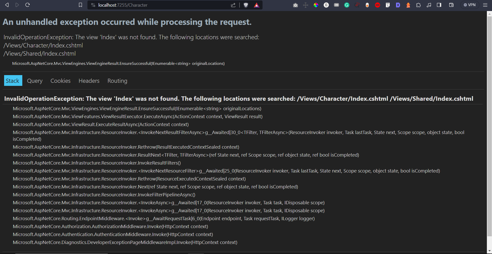
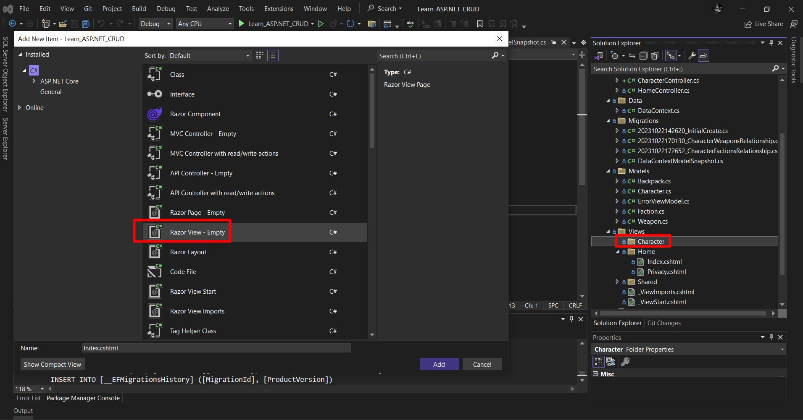
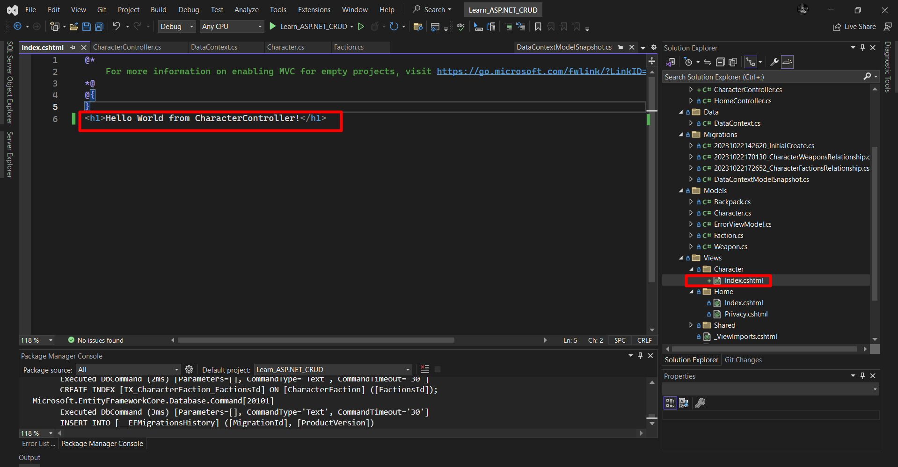
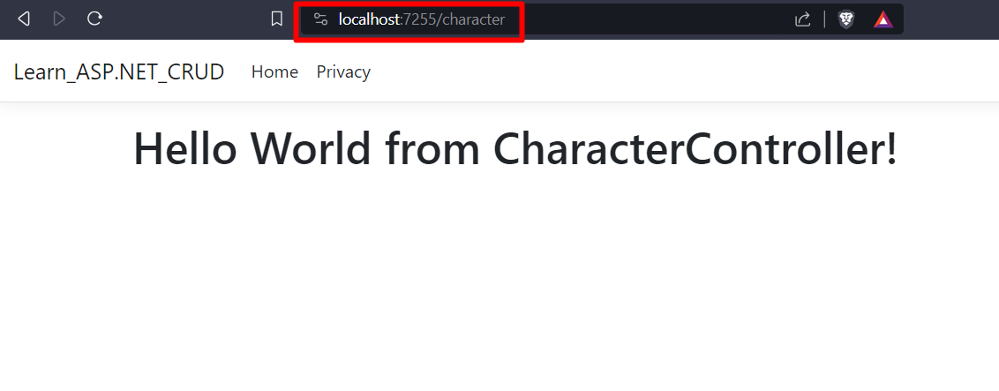

# ASP.NET Core Web App (Model-View-Controller) - VERSIUNEA 7
- Tutorial simplu pt MVC controller: https://www.youtube.com/watch?v=709kkA8v_WA
- (in videoclipul anterior, dupa minutul 29, era vorba de API controller)
## Controller
24. Controlerelle prin conventie trebuie sa fie denumite cu "Controller" la final. De exemplu CharacterController.
- Dam click dreapta pe folderul Controllers -> Add -> New Scaffolded item...
- Aici avem mai multe optiuni, dar pentru inceput, pentru a intelege mai bine cum functioneaza totul de la 0, alegem "MVC Controller - Empty" si il denumim CharacterController
- Acum daca dam start aplicatiei si scriem sus in search bar-ul din browser /character si dam enter, o sa primim eroare. 

- Avem eroarea asta pentru ca metoda Index() din CharacterController returneaza un View(), adica o pagina cu numele index, care se afla in interiorul folderului Character. Dar noi nu am creat inca folderul Character si nici fisierul index.cshtml. Prin acea "conventie" de care ziceam la inceput, framework-ul gaseste folderul si pagina buna dupa numele de dinainte de controller, adica "Character" din "CharacterController".
- Cream folderul Character, iar apoi un "Razor Page - Empty" cu numele index

- Putem scrie un tag html cu un mesaj in aceasta pagina pentru a testa din nou. De exemplu: <h1>Hello World from CharacterController!</h1>

- Apoi dam start aplicatiei (sageata verde de sus). Apoi mergem pe ruta /character si avem mesajul pe care l-am scris anterior:

- Deci asa putem returna o pagina prin intermediul unui controller 